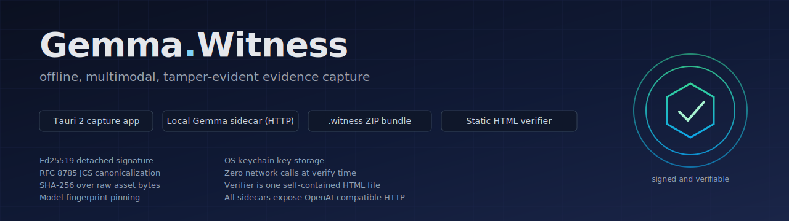

<p align="center">
  
</p>

<h1 align="center">Gemma.Witness</h1>

<p align="center">
  Offline, tamper-evident evidence capture for field journalism. Signed in your hand, verified in a browser, with no server in the loop.
</p>

<p align="center">
  <a href="LICENSE"></a>
  
  
  
  
</p>

<p align="center">
  <video src="https://files.catbox.moe/90zlt6.mp4" controls width="720" muted playsinline></video>
</p>

<p align="center">
  <a href="https://files.catbox.moe/90zlt6.mp4">▶ Watch the 75-second demo</a>
</p>

---

## Why this matters

A reporter is working in a country where journalists are detained for their reporting. She records a witness account. She attaches the photos she just took. She seals the file before she leaves the room.

A week later, an editor on another continent opens a single static HTML page in any browser and drags the file in. Three checks turn green:

- the signature comes from the reporter's device
- the audio and the photos have not been altered by a single byte
- the AI model in the chain is the published Gemma model she named, not a substitute trained to mislead

In plain language: the file in the editor's hands was made by the reporter and nobody else. Not one byte of the recording or the photos has changed since she sealed it. The AI in the chain is the model the manifest says it is, full stop. That property has a name. Archivists call it provenance. Lawyers call it chain of custody. It is the same idea: a verifiable answer to who made this, and what has happened to it since.

Gemma 4 is not a black box in the corner of this picture. The manifest names the exact release by id, by revision, and by file hash, so the model is a fingerprinted participant in the chain rather than an unaudited ingredient. We chose Gemma 4 for three reasons. It runs fully on the reporter's device, so the model itself is not a leak surface. Its native multimodal capability lets one model own the audio, the images, and the reasoning, so the manifest pins one identity instead of three. The 4-bit E4B variant is small enough to run on a journalist's laptop in the field.

Gemma.Witness leaves the file openly readable. What it proves is who made it, that nothing has changed since, and that the AI involved has not been substituted.

No server saw any of it. No account was created, no file uploaded, no metadata left behind on a platform that could later be served a subpoena or a takedown notice.

That is what Gemma.Witness exists for. The rest of this document explains how.

## Status

This is a beta. The full capture and verification chain runs offline and the seal path on macOS prefers the Apple Secure Enclave so the signing key never leaves hardware. Linux and Windows still sign with a software keychain key today (Linux TPM 2.0 and Windows NCrypt backends are tracked; the trait surface for them is already in place). Read the [limitations](#current-limitations) section before relying on it for real-world evidence handling.

## The use case it leads with

A reporter in the field records a witness account, attaches camera-roll photos, runs a local Gemma 4 pipeline to transcribe, structure, and cross-check the inputs, then seals the result into a single `.witness` file. The file is signed by a device-held Ed25519 key. The model identity is pinned in the signature scope. The reasoning trace is captured byte-for-byte.

Later, an editor, a fact-check desk, or a press-freedom organization opens a static HTML page in any browser, drags the `.witness` file in, and sees three checks resolve to green or red:

- the signature over the manifest is valid
- every asset's SHA-256 matches what the manifest claims
- the model fingerprint is on the published known-good list

No server, no account, no network. If a single byte of the audio is altered after sealing, the asset check fails and the verifier names which file and which mismatch.

Where else this pattern fits, with no UI changes: labor and safety incident reports verified by a union steward, witness statements at protests verified by counsel before going into a case file, environmental observations verified by the receiving NGO. The bundle format and the verifier do not care about the framing.

## What it does

The capture app records audio, accepts images, runs a local four-pass Gemma 4 pipeline (transcribe, structure, per-image analyze, cross-modal consistency check), and writes a deterministic `.witness` ZIP whose `manifest.json` is signed under RFC 8785 JCS canonicalization with the device's Ed25519 key. The manifest commits to every asset's raw-byte SHA-256, the reasoning trace, the structured incident report, the model fingerprint (model id + revision + `model.safetensors` SHA-256), and the capture environment.

The verifier is a single static HTML file plus the noble crypto libraries. It opens the bundle as a ZIP in the browser, recomputes hashes, verifies the signature against the embedded public key, and confirms the model fingerprint is on the published list. CI enforces that the built verifier contains no `fetch`, `XHR`, or `importScripts` call.

## Architecture

```
Capture App (Tauri 2)
        │
        ▼
Local inference sidecar
        │
        ▼
Signed .witness bundle
        │
        ▼
Offline HTML verifier
```

The repository includes:

- a desktop capture application
- multiple local inference sidecars
- a Rust core library
- a static verifier
- a CLI pipeline
- evaluation tooling

### Execution flow

1. Record audio and select images
2. Run the local four-pass inference pipeline
3. Review the generated report
4. Seal the evidence bundle
5. Verify hashes, signatures, and fingerprints offline

The signing payload uses RFC 8785 JCS canonicalization before Ed25519 signing.

## Repository layout

| Path | Purpose |
| :--- | :--- |
| `crates/witness-core` | Canonicalization, hashing, signing, verification, bundle generation |
| `crates/witness-inference` | Four-pass inference pipeline |
| `crates/witness-cli` | Headless CLI pipeline |
| `crates/witness-eval` | Evaluation harness |
| `apps/capture` | Tauri capture application |
| `apps/verifier` | Static offline verifier |
| `inference/mlx-sidecar` | Apple Silicon inference path |
| `inference/mistralrs-sidecar` | Cross-platform Rust inference path |
| `inference/transformers-sidecar` | Python fallback inference path |
| `tools/check-pinned-binary` | Refuses sidecar launch when the inference binary's SHA-256 does not match `PINNED.json` |
| `tools/seed-fingerprints` | Seeds and re-verifies entries in `inference/fingerprints/` |

## Implemented features

Current implementation includes:

- offline capture workflow
- multimodal four-pass pipeline
- OpenAI-compatible inference sidecars
- structured incident extraction
- reasoning trace capture
- RFC 8785 JCS canonicalization
- Ed25519 signing and verification
- deterministic ZIP generation
- static offline verifier
- verifier integrity checks
- model fingerprint pinning
- advisory perceptual audio fingerprint (re-derived by `witness verify --acoustic`)
- per-pass inference parameter capture (sampling parameters, prompt SHA-256 per pass)
- amendment-chain reference (`manifest.amends`) for issuing signed corrections
- Rust round-trip verification tests
- transport-survival tests (bundles re-verified after deflate rezip)
- GitHub Actions CI
- coverage reporting
- evaluation tooling

Cross-platform live capture remains partially unverified outside the Apple Silicon path.

## Security and supply chain

Tamper-evidence in this project depends on more than a signature: the build, the verifier, the inference boundary, and the release pipeline all have to hold. Each of the properties below is enforced in code and regression-tested in CI.

- **Signed releases.** Tagged releases run `.github/workflows/release.yml`, which builds on macOS, Linux, and Windows, writes `SHASUMS256.txt`, signs it via Sigstore keyless cosign, and attaches SLSA v1 build provenance. The cosign OIDC identity that verifiers MUST pin is published in [`RELEASE.md`](RELEASE.md).
- **Reproducible builds.** The verifier HTML and the headless CLI rebuild bit-for-bit from a clean checkout via three independent paths (a Nix flake, `Dockerfile.repro`, or the pinned host toolchain), all enforced by `.github/workflows/reproducibility.yml`. `SOURCE_DATE_EPOCH`, `CARGO_INCREMENTAL=0`, and `RUSTFLAGS=--remap-path-prefix=...` make the binary timestamp-stable; esbuild is invoked with every determinism flag pinned and the verifier's SHA-256 is committed to `apps/verifier/expected-output-hash.txt`. The full rebuild recipe is in [`RELEASE.md` §"Verifying a release reproducibly"](RELEASE.md#verifying-a-release-reproducibly).
- **Strict signature verification.** The Rust verifier uses Ed25519 `verify_strict` (RFC 8032 §5.1.7) and asserts every field of `signature.json` (algorithm, canonicalization, signed payload, key id) against the manifest before checking the signature. The JS verifier enforces the same gates and adds a "signed by a known witness" check against an inlined `trusted-signers.json`.
- **Bundle integrity.** Both verifiers reject unexpected ZIP entries, duplicate entries, path-traversal names, and zip-bomb payloads (per-entry and total-decompressed caps). The manifest's structural fields are checked with `deny_unknown_fields` (Rust) and a traversed `validateManifest` (JS) before any signature work.
- **Cross-language canonicalization parity.** Twenty-one edge-case JSON values (subnormals, negative zero, integers above 2^53, control characters, RTL marks, ZWJ emoji sequences, 256-key lexicographic sort, deep nesting, numeric notation collapse) are pinned to byte-identical outputs by a conformance suite that runs in CI on every push. Integers above 2^53 are projected onto their IEEE 754 double representation before canonicalization so the Rust signer and the JavaScript verifier never disagree on a value the verifier's parser cannot represent natively.
- **Sidecar boundary.** The capture app generates a 32-byte per-launch token and rejects any non-loopback sidecar endpoint. Inference responses are streamed with a 10 MiB cap. Picked images are staged into a per-capture UUID directory before inference so the model and the seal step read identical bytes.
- **Build supply chain.** Every GitHub Action is pinned to a 40-character commit SHA, every cargo invocation in CI carries `--locked`, and `cargo audit`, `cargo deny`, and `pnpm audit` run on every push. `.github/dependabot.yml` opens weekly SHA-bump PRs.
- **Fingerprint provenance.** The shipped MLX entry was re-seeded against the Hugging Face LFS oid (`verified_by: "huggingface-lfs+local-recompute"`).

These are tamper-evidence guarantees about the bundle and its distribution chain. They are not guarantees against a coerced reporter, a pre-compromised device, or social engineering of the trust-anchor lists. See the [Threat model](#threat-model) section for the full delineation.

### Reporting a vulnerability

[`SECURITY.md`](SECURITY.md) is the canonical disclosure policy. Use the
GitHub private vulnerability reporting flow (the "Report a vulnerability"
button on the repository's Security tab) for almost everything; encrypted
email and an out-of-band Signal contact are documented for cases where
that channel does not fit your threat model. Acknowledgements that name a
CVE, a fix commit, or a disclosure timeline are signed with the same
cosign keyless identity used for releases, with a verification recipe at
[`docs/security-acknowledgement-format.md`](docs/security-acknowledgement-format.md).

## Installation

### Prerequisites

| Requirement | Notes |
| :--- | :--- |
| Rust 1.80+ | Workspace MSRV |
| Node 22 | Used by verifier and capture frontend |
| pnpm 9 | Used in CI |
| Python 3.13 | Required for mlx-sidecar |
| Apple Silicon | Required for mlx-vlm path |

### Build

From the repository root:

```bash
cargo build --workspace
```

Build the verifier:

```bash
cd apps/verifier
pnpm install --frozen-lockfile
pnpm build
cd -
```

Install capture app dependencies:

```bash
cd apps/capture
pnpm install --frozen-lockfile
```

### Inference sidecars

Choose one inference backend.

Apple Silicon (primary path):

```bash
./inference/mlx-sidecar/start.sh
```

mistralrs:

```bash
./inference/mistralrs-sidecar/start.sh
```

The pinned `mistralrs` version is enforced by the start script; see
`inference/mistralrs-sidecar/README.md` for the pinned `cargo install
--locked --git ... --rev <SHA>` incantation. To pin a new model revision,
run `cargo run -p seed-fingerprints -- --model-id <id> --revision <rev>`
with the weights cached locally. The seeder cross-checks the local
`model.safetensors` SHA-256 against the Hugging Face LFS oid and refuses
to write on mismatch.

Transformers fallback:

```bash
cd inference/transformers-sidecar
uv sync
uv run python start.py
```

`uv sync` is the only supported install path; the previous unpinned
`requirements.txt` was removed to close the "PyPI typo-squat lands on the
sidecar process" supply-chain gap.

All sidecars expose an OpenAI-compatible API on `127.0.0.1:8080`.

## Usage

### CLI pipeline

Structure-only pass:

```bash
cargo run -p witness-cli -- structure \
  --transcript tests/fixtures/day1-sample.txt
```

Full pipeline:

```bash
cargo run -p witness-cli -- pipeline \
  --audio tests/fixtures/day-3-scenarios/1/audio.wav \
  --image tests/fixtures/day-3-scenarios/1/image1.jpg \
  --image tests/fixtures/day-3-scenarios/1/image2.jpg
```

### Capture app

```bash
cd apps/capture
pnpm tauri dev
```

Workflow:

1. record
2. attach images
3. run inference
4. review
5. seal

### Verifier

```bash
cd apps/verifier
pnpm build
```

Open `dist/verify.html`, then drag a `.witness` bundle into the verifier.

The verifier build fails if the generated HTML contains:

- external network references
- `fetch`
- `XMLHttpRequest`
- `importScripts`

## Configuration

| Item | Default |
| :--- | :--- |
| Sidecar endpoint | `http://127.0.0.1:8080` |
| Audio format | 16 kHz mono WAV |
| Recording cap | 30 seconds |
| Manifest schema version | `1` |
| Key service | `tech.aftermath.gemma-witness` |

A `.env.example` file is included for reference.

## Development

### Tests

Run all Rust tests:

```bash
cargo test --workspace -- --test-threads=1
```

Verifier end-to-end tests:

```bash
cd apps/verifier
pnpm install
pnpm build
npx tsx tests/e2e.test.ts
```

Live end-to-end sidecar test:

```bash
cargo test -p witness-core --test day-4-e2e -- --nocapture
```

The live test skips automatically if no sidecar is reachable.

### Lint and coverage

```bash
cargo fmt -- --check
cargo clippy --workspace --all-targets -- -D warnings

cd apps/verifier && pnpm lint
cd apps/capture && pnpm lint
```

Coverage:

```bash
cargo tarpaulin --workspace --out Html --out Xml -- --test-threads=1
```

### CI

GitHub Actions currently runs:

- Rust build and test (every `cargo` invocation pinned with `--locked`)
- clippy with `-D warnings`
- coverage generation
- verifier end-to-end tests
- canonicalization conformance (cross-language byte-equality between `serde_jcs` and `canonicalize`)
- degraded-path Rust tests
- em-dash scan enforcement
- supply-chain audit: `cargo audit`, `cargo deny check`, `pnpm audit` on both workspaces
- signed-release workflow on `push: tags: ['v*']` (cosign + SLSA v1 provenance)

The full live-model end-to-end test (`crates/witness-core/tests/day-4-e2e.rs`) is a release gate, not a per-push gate. The GitHub macOS runner cannot host the Gemma 4 model, so the same test compiles and exits via its skip path in CI. The hermetic e2e against `witness-test-sidecar` runs on every push on Linux, Windows, and macOS, covering the schema-drift class of bugs. The maintainer runs the live e2e locally before tagging a release; see [`RELEASE.md`](RELEASE.md).

## Platform compatibility

The capture binary, the wire format, and the verifier are portable. The inference backends are not: each picks the host architecture and accelerator it was built for.

| Backend       | macOS arm64 | Linux x86_64 | Windows x86_64 |
| :------------ | :---------- | :----------- | :------------- |
| mlx-vlm       | best        | not supported | not supported |
| mistralrs     | ok          | ok (CUDA)    | ok (CUDA)      |
| transformers  | slow        | ok           | ok             |

CI exercises the full capture-to-seal-to-verify pipeline on Linux, Windows, and macOS via `witness-test-sidecar`, a hermetic OpenAI-compatible fake that returns precomputed fixture responses. No real model is required for that gate. The constraints in the table are intrinsic to the inference backends, not to Gemma.Witness.

## Threat model

The chain runs from the moment of capture to the moment a third party reads the file back. The actors are the reporter, the editor or counsel verifying later, the model, the device, the network, and in the worst case a courtroom.

Defends against: post-capture tampering of any asset (a flipped byte fails the named asset-hash check), substitution of the model that produced the reasoning (the manifest pins `model_id`, `revision`, and `model.safetensors` SHA-256 inside the signature scope), forgery of the manifest itself (JCS-canonicalized bytes signed with a device Ed25519 key that never leaves the OS keychain), accidental re-encoding or byte truncation during transport (asset checks fail), bundles produced by an unknown model (fingerprint membership check fails), signature forgery without the device key (infeasible under Ed25519).

Does not defend against: a coerced reporter signing a falsified narrative, a device compromised before sealing, a tampered camera or microphone upstream of the file system, social engineering of the verifier's known-fingerprint list, or traffic analysis of who produced bundles when. The bundle says what the device with this key sealed at this time using this model. It does not say what actually happened.

## Current limitations

These are real limitations in the current implementation.

### Trust model limitations

- **macOS**: signing keys live in the Apple Secure Enclave (ECDSA P-256, non-extractable). The seal command renders a "Hardware-backed signature" banner when this path is in effect, and falls back to the software OS-keychain Ed25519 path with a visible "Software-only signature" warning if the SEP is unreachable.
- **Linux**: TPM 2.0 backend is tracked but not yet wired up; the seal path falls back to a software OS-keychain Ed25519 key with a visible warning.
- **Windows**: NCrypt + platform crypto provider is tracked but not yet wired up; no Windows host is available to the maintainer for live bring-up, so this backend remains a stretch goal.
- No external certificate authority or transparency log; verification still operates as a TOFU-style trust model. WS5 is the workstream that closes this gap (signer registry + Rekor).

A compromised user account can sign arbitrary bundles on any of the above paths, hardware-backed or not. Hardware backing proves *which device* signed, not *who held it*.

### Fingerprint provenance

Fingerprints live in a single registry at `inference/fingerprints/`, embedded into the capture binary at compile time via the `witness-fingerprints` crate. The seal command queries the live sidecar's `/v1/models` and looks up the matching entry, so the bundle records whichever model the running sidecar is actually serving.

`tools/seed-fingerprints` is the only supported way to add or update an entry. It fetches the Hugging Face LFS oid for a pinned `(model_id, revision)`, recomputes the SHA-256 of the locally cached `model.safetensors`, and refuses to write on mismatch. The shipped MLX entry carries `verified_by: "huggingface-lfs+local-recompute"`, meaning both the HF LFS oid and a fresh local hash were cross-checked at seed time. Re-run the seeder before any release that bumps the pinned revision; see [`RELEASE.md`](RELEASE.md).

### Audio model behavior

- `inference/mlx-sidecar` (mlx-vlm): the audio bytes flow into the model via the `input_audio` content part natively.
- `inference/transformers-sidecar`: now reads audio with torchaudio, resamples to 16 kHz mono in memory, and hands the waveform to the processor under the `audio=` kwarg. The on-disk bytes the manifest hashes are not modified.
- `inference/mistralrs-sidecar`: audio support is gated by `crates/witness-inference/tests/mistralrs_audio_probe.rs`, which sends an OpenAI-standard `input_audio` content part and asserts the response is acoustically informed. The release workflow runs the probe with `WITNESS_MISTRALRS_REQUIRE=1` so a tag cannot land without a working audio path. Hosts running mistral.rs locally should run the probe before sealing.

### Inference binary pinning

`inference/mistralrs-sidecar/PINNED.json` records the audited mistral.rs upstream commit and the SHA-256 of the built `mistralrs-server` binary for every published target triple. The sidecar's `start.sh` delegates to `tools/check-pinned-binary`, which refuses to launch when the hash does not match. `.github/workflows/build-mistralrs.yml` is the only sanctioned path for adding or updating entries: it builds from the pinned commit on a clean runner, hashes the result, and either opens a PR (bootstrap path) or attaches binaries to the GitHub release and verifies reproduction (tag path). A `--allow-local-dev` bypass exists for hosts where no published binary covers the target triple yet; it prints a visible WARNING and is never set on release-gate paths.

## What you can verify yourself

The repository is structured so most claims can be checked locally.

Build the offline verifier:

```bash
cd apps/verifier
pnpm install
pnpm build
```

Run verifier end-to-end tests:

```bash
npx tsx tests/e2e.test.ts
```

Run Rust verification suites:

```bash
cargo test --workspace
```

Inspect the wire format directly:

```bash
cat spec/bundle-format.md
cat spec/manifest-schema.json
cat spec/incident-schema.json
```

Performance and latency characteristics are hardware-dependent and are not benchmarked in this repository.

## Contributing

Project rules are intentionally strict.

Key conventions:

- no `unwrap()` outside tests
- no TypeScript `any`
- no default exports
- kebab-case TypeScript filenames
- snake_case Rust modules
- no em dashes
- conventional commits required

Important invariants:

- signatures cover JCS-canonicalized bytes
- asset hashes are computed from raw bytes
- reasoning traces are stored verbatim
- private keys never leave the keychain

See:

- [`CLAUDE.md`](CLAUDE.md)
- [`.github/copilot-instructions.md`](.github/copilot-instructions.md)

## License

MIT. See [LICENSE](LICENSE).
